# intro

An application wizard package. 

With this package, you can implement a step-by-step guide to help you demonstrate your software or introduce your product.

## Features

- Step by step demonstration
- Control the presentation process
- Highlight the target widget
- Automatically calculates the card display position and alignment
- Customizable style and behavior
- Supports nesting of multiple presentation processes
- Link between different pages or dialogs
- Full platform support

## Demo

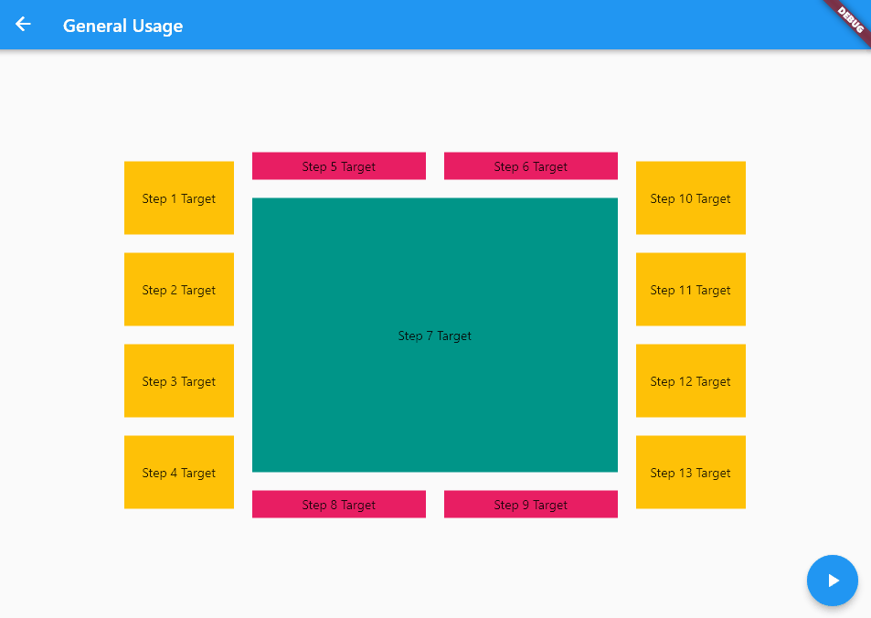


## Getting started

Add this package to your project.

```shell
flutter pub add intro
```

Import it in your code.

```dart
import 'package:intro/intro.dart';
```

Register the `Intro` widget at the earliest possible widget tree node.

Provide a `IntroController` that has specified the `stepCount`. The `stepCount` refers to the total number of steps in the presentation process.

```dart
runApp(Intro(
  controller: IntroController(stepCount: 5),
  child: MaterialApp(
    home: HomePage(),
  ),
));
```

Wrap the `IntroStepTarget` widget around each of your target widgets that you need to introduce.

```dart
IntroStepTarget(
  step: step,
  controller: Intro.of(context).controller,
  cardContents: TextSpan(
    text: "The introductory text of this step.",
  ),
  child: targetWidget,
);
```

Start the presentation process at the right time.

```dart
Intro.of(context).controller.start(context);
```

## General Usage

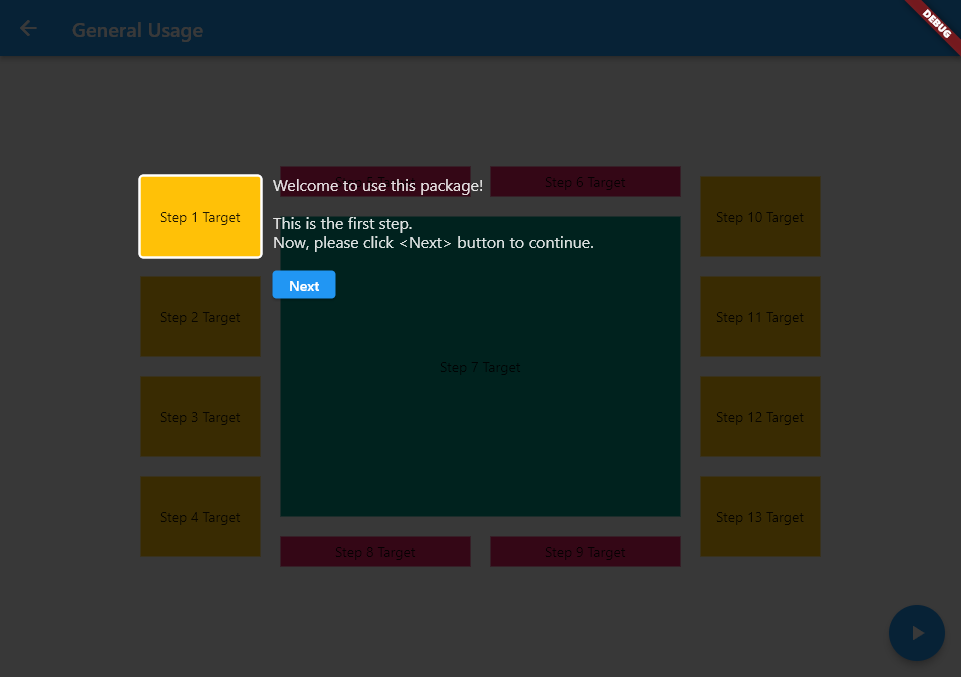

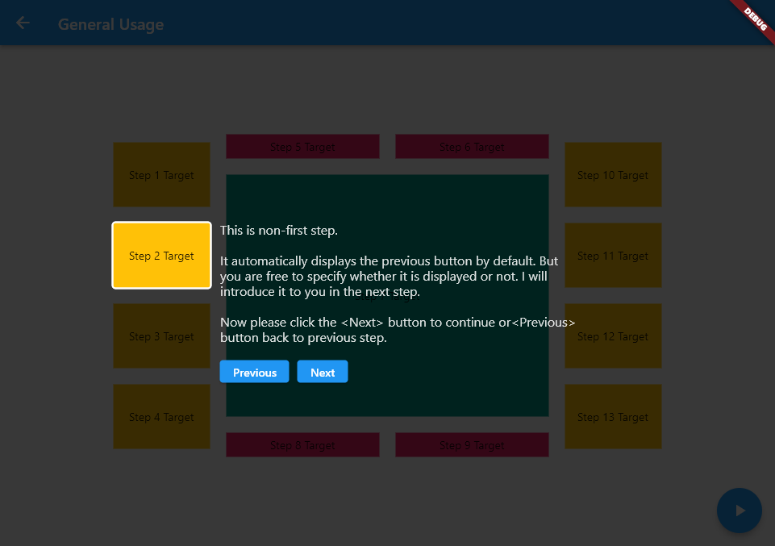

Decoration of an introductory card. 

Provided in the `cardDecoration` field of the `IntroStepTarget` widget (targeted) or the `Intro` widget (global).

```dart
IntroCardDecoration(
  align: IntroCardAlign.insideTopLeft,
  size: Size(420, 280),
  padding: EdgeInsets.all(10),
  margin: EdgeInsets.all(20),
  border: Border.all(color: Colors.black),
  radius: BorderRadius.circular(10),
  backgroundColor: Colors.teal,
  showPreviousButton: true,
  showNextButton: true,
  showCloseButton: true,
  autoHideDisabledButton: false,
  previousButtonLabel: "Previous",
  nextButtonLabel: "Next",
  nextButtonFinishLabel: "Finish",
  closeButtonLabel: "Close",
  previousButtonStyle: ButtonStyle(...),
  nextButtonStyle: ButtonStyle(...),
  closeButtonStyle: ButtonStyle(...),
)
```

Decoration of a highlight area. 

Provided in the `highlightDecoration` field of the `IntroStepTarget` widget (targeted) or the `Intro` widget (global).

```dart
IntroHighlightDecoration(
  padding: EdgeInsets.all(10),
  border: Border.all(color: Colors.white),
  radius: BorderRadius.circular(5),
  cursor: SystemMouseCursors.click,
)
```

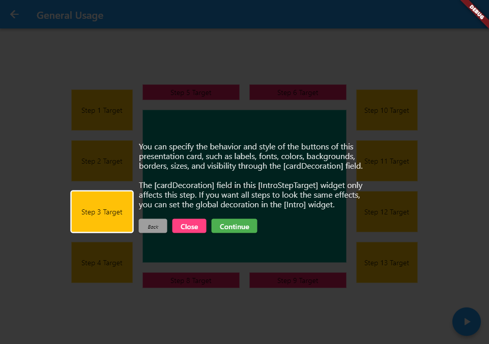

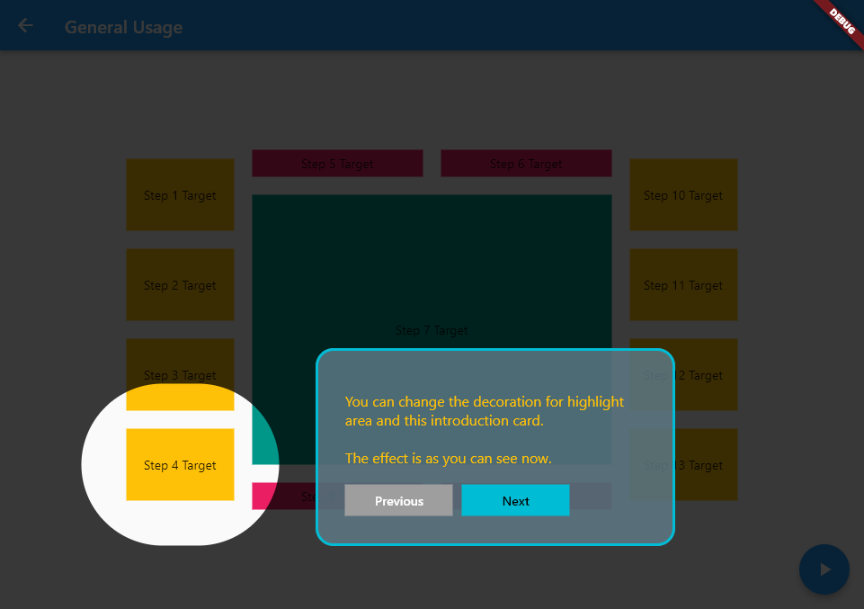

Provided in the `cardContens` field of the `IntroStepTarget` widget. 

```dart
IntroStepTarget(
  cardContens: TextSpan(
    children: [
      TextSpan(text: "paragraph 1\n"),
      TextSpan(text: "paragraph 2\n"),
    ],
  ),
);
```

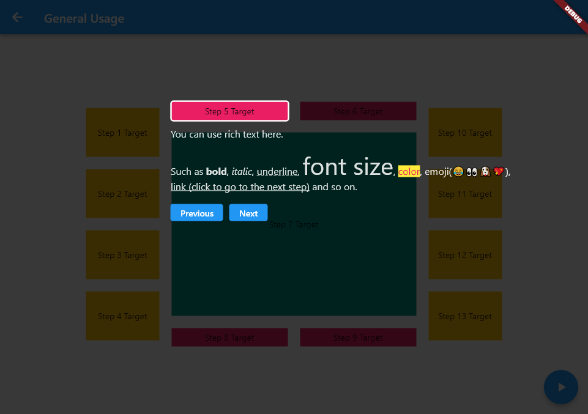

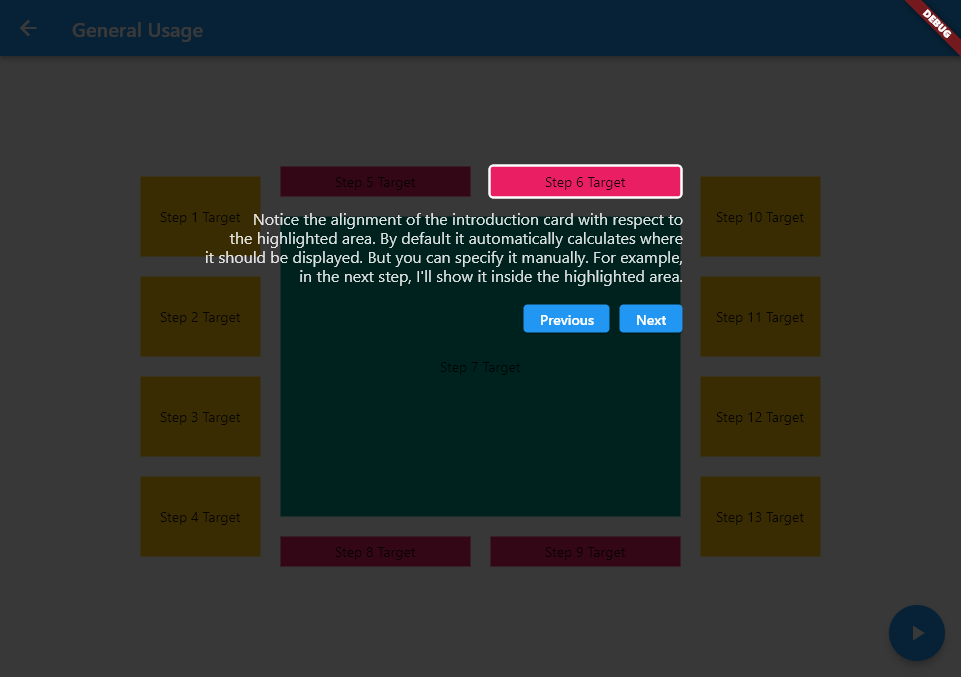

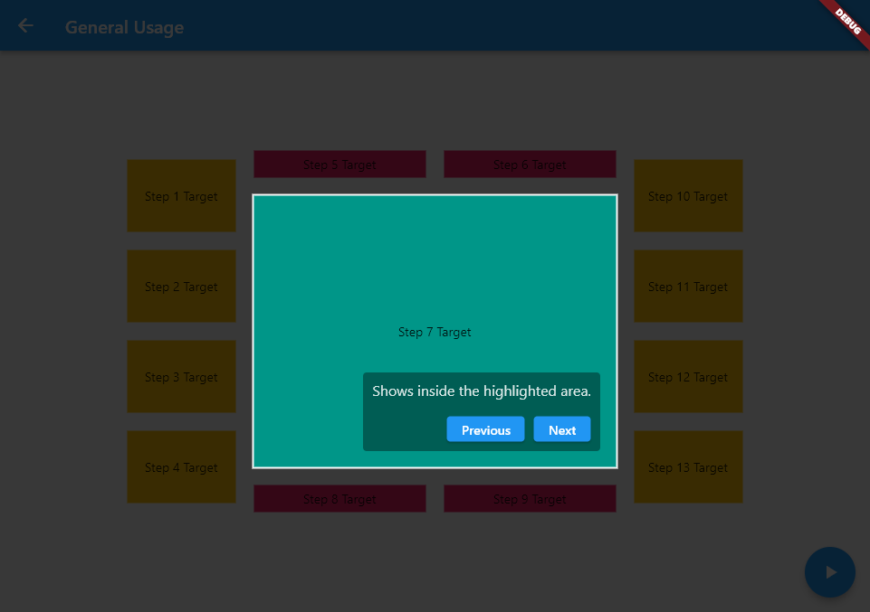

Event handling:

```dart
IntroStepTarget(
  onTargetLoad: () {
    // TODO: 
  },
  onTargetDispose: () {
    // TODO: 
  },
  onTargetTap: () {
    // TODO: 
  },
  onStepWillActivate: (fromStep) {
    // TODO: 
  },
  onStepWillDeactivate: (willToStep) {
    // TODO: 
  },
);
```

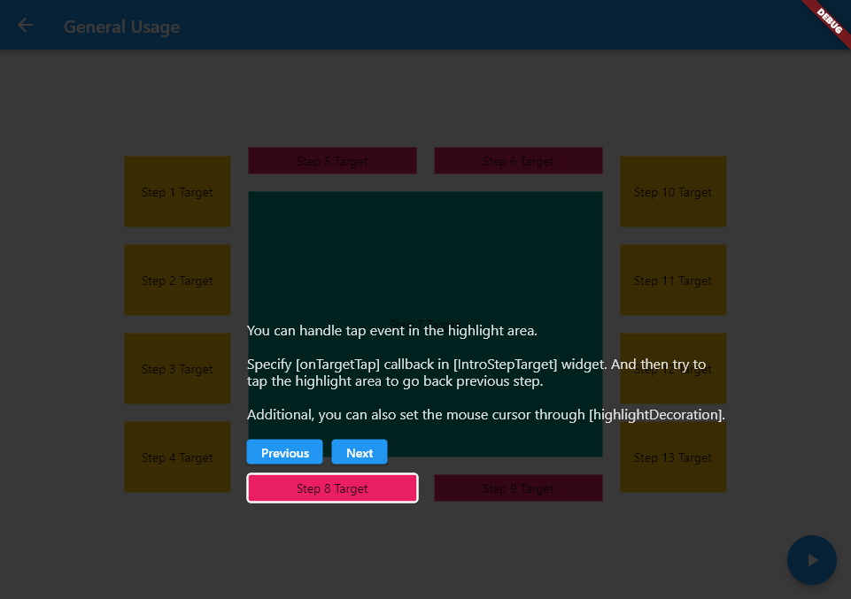

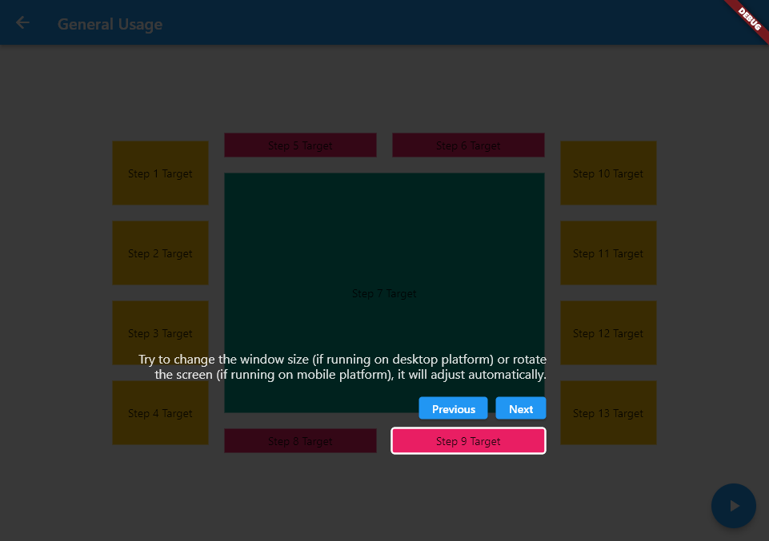

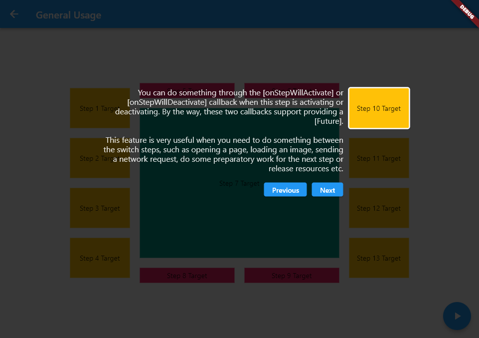

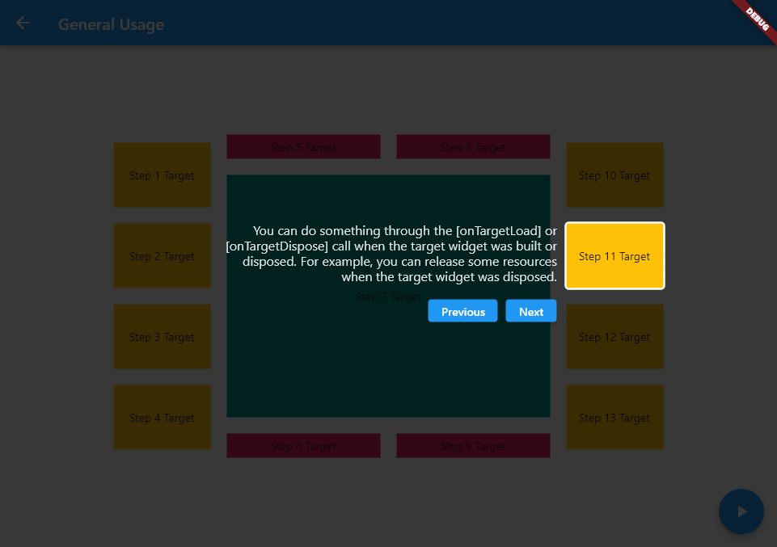

Customize the introduction card.

```dart
IntroStepTarget.custom(
  step: step,
  controller: controller,
  cardBuilder: (BuildContext context, IntroParams params, IntroCardDecoration decoration) {
    return Container(...);
  },
  child: child,
);
```


`IntroController` to control the presentation flow.

```dart
final controller = Intro.of(context).controller;
final stepCount = controller.stepCount;
final isOpened = controller.isOpened;
controller.start(context, initStep: 3);
controller.next();
controller.previous();
controller.jumpTo(5);
controller.close();
controller.refresh();
controller.dispose();
```

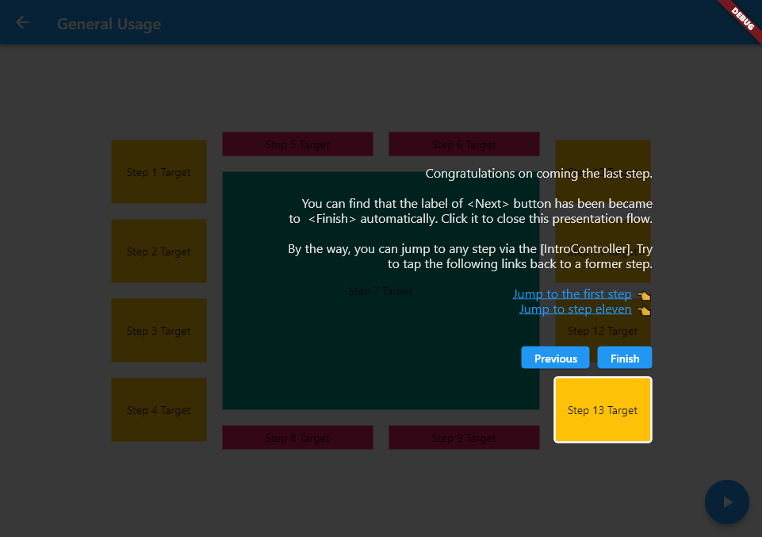

> To see the full demonstration, read the example code please.


## Nested Usage

You can define multiple [Intro] widgets and each one uses a separate [IntroController].

1. The same target widget may be used in different presentation processes.
2. The same target widget can define different introduction card in different presentation flows.
3. Each presentation flow is controlled through its own [IntroController].

> To see the full demonstration, read the example code please.


## Advanced Usage

> To see the full demonstration or more advanced features, read the example code please.
